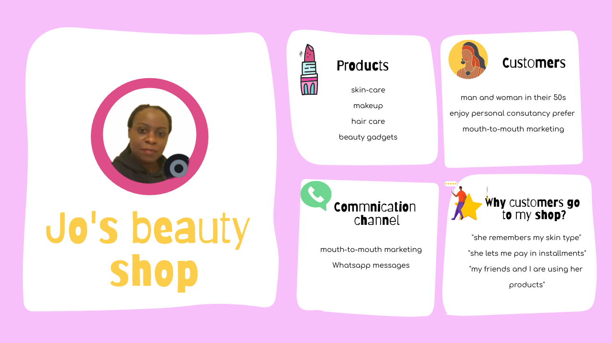

# User Personas

**App purpose**: Jo's personal assistant app

## Jo - the shop owner

- **Bio**: Jo owns a self-owned beauty shop that is mainly run via mouth to
  mouth marketing. Her USP is she lets her customers pay in installments and her
  great customer service.
- **Needs/Goals**: Jo wants to expand her business to 100 customers (now she
  has 30) and she needs a data management app that is simple to use.
- **Frustrations**:

1. She only uses excel right now so it requires much manual work and it does not
   send out reminder automatically.
2. She often forgets about the cusomter's payments and their due dates.
3. She can't give the right consultation to her customers because she can't
   remember everyone

- **Scenario**: Jo is looking an app that can help her organize her customers'
  information and transactions. An app that can export data so she can work on
  her computer too.

### Jo's business

